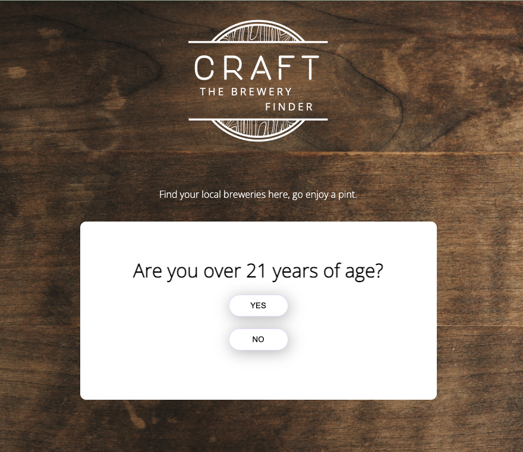

# Craft - The Brewery Finder

> This is an application that allows users to find local breweries' information by location.

## Table of Contents
-----
<ul>
    <li>Mock Up Image</li>
    <li>Technologies</li>
    <li>Setup</li>
    <li>Code Examples</li>
    <li>Screenshot</li>
    <li>Features</li>
    <li>Status</li>
    <li>To-Do</li>
    <li>Inspiration</li>
    <li>Installation Instructions</li>
    <li>Difficulties</li>
    <li>Acknowledgements</li>
    <li>Contact</li>
</ul>

### Mock Up Image
-----

### Technologies
-----
<ul>
    <li>HTML</li>
    <li>CSS</li>
    <li>Javascript</li>
    <li>jQuery</li>
</ul>

### Setup
-----
Deployed to Render.com  
[GitHub Repository](https://github.com/cwon07/project1)

### Code Examples
-----
 
 $.ajax({
        type: "GET",
        url: `https://api.openbrewerydb.org/v1/breweries?by_city=${city}&per_page=50`,
        })
        .then((data) => {
            console.log(data.length)
       let list = ""; 
        for(let i = 0; i < data.length; i ++) {
            const item = data[i]
            console.log(item.name, item.brewery_type, item.city, item.state, item.website_url)
            list +=

            `<li>
            

                

                    <b>Name:&nbsp; </b> ${item.name}
                

                

                    <b>Brewery Type:&nbsp; </b> ${item.brewery_type}
                

                

                    <b>City:&nbsp; </b> ${item.city}
                

                

                    <b>State:&nbsp; </b> ${item.state}
                

                

                    <b>Website:&nbsp; </b> ${item.website_url}
                

            

            </li>`;
        }});          

### Screenshot

### Features
-----
<ul>
    <li>Find breweries by city
    <li>Access brewery information, such as address, business type, city, state, and business website
    <li>Random brewery suggestion based on city 
</ul>

### To-Do
-----
<ul>
    <li>Create a pop up to ask if the user is over 21 years of age - if no, redirect to a Google search page with search word "How to make butterbeer"</li> 
    <li>HTML to add structures to the app</li>
    <li>CSS to stylize the app</li>
    <li>Apply JavaScript codes, including jQuery & ajax, to call and display brewery information on the app</li>
    <li>Figure out how to show Open Street Map data on the app</li>
</ul> 

### Inspiration
-----
Calling all beer enthusiasts! I came across [Open Brewery Database API](https://www.openbrewerydb.org/) and was reminded of the brewery crawls I did in Portland way back when I was chidlless and free(jk prob going to remove this line). There are so many great breweries out there that are so unique and awesome but don't often get caught in people's radar, so I wanted to build an app to make curated lists of breweries based on the users' location.

### Installation Instructions
-----
Simply fork and clone the repo! No other installation steps needed. 

### Difficulties 
-----
Initially, I wanted this site to be more user-friendly and intuitive than what my current skill level can handle. I wanted it to feature several other features, such as drop down search option to sort brewery types, feature a map for each brewery, etc. I decided to focus more on hitting the MVPs and kept it simple in the end. I may revisit this project to apply the features later on when I have learned the skills. 

### Acknowledgements
-----
[How to make an automatic popup window](https://foolishdeveloper.com/how-to-create-automatic-popup-window-using-html-css/)
[How to get search results in boxes](https://stackoverflow.com/questions/63567537/how-to-get-search-results-in-different-boxes-in-html)

### Contact 
-----
Created by:
[Christine Wong](https://github.com/cwon07)
